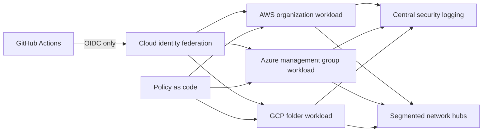

# Secure Multi Cloud Landing Zone

**Status:** In progress — architecture and control specification complete; Terraform modules are next.

## Goal

Build a vendor-neutral reference implementation for secure account and project vending across AWS, Azure, and GCP using Terraform, short-lived workload identity, network segmentation, centralized logging, and policy checks.

## Proof to produce

- Architecture diagram with management, identity, logging, networking, and workload boundaries.
- GitHub Actions OIDC federation with no static cloud credentials.
- Reusable Terraform modules and environment promotion gates.
- Policy tests for public exposure, encryption, logging, and least privilege.
- Automated teardown and a documented cost ceiling.

## Resume signal

Demonstrates that enterprise landing-zone and identity patterns can be communicated publicly without exposing proprietary implementation details.

## Architecture

The design deliberately separates management, identity, logging, networking, and workload ownership. CI receives short-lived, repository-scoped credentials; no cloud access keys are stored in GitHub.

## Control contract

The machine-readable baseline lives in [`controls/baseline.yaml`](controls/baseline.yaml). Every implementation must demonstrate:

- no anonymous public access;
- encryption at rest and in transit;
- centralized audit logging with defined retention;
- short-lived workload identity;
- environment and owner metadata;
- default-deny boundaries and explicit exceptions;
- automated tests before promotion.

## Delivery sequence

1. Implement provider-specific identity federation modules.
2. Add secure logging/storage foundations for AWS, Azure, and GCP.
3. Generate Terraform plans in CI and evaluate them with policy as code.
4. Publish test output, threat-model coverage, and teardown evidence.

## Current evidence

- [Architecture decision record](docs/ADR-001-identity-and-boundaries.md)
- [Threat model](docs/THREAT-MODEL.md)
- [Baseline control contract](controls/baseline.yaml)
