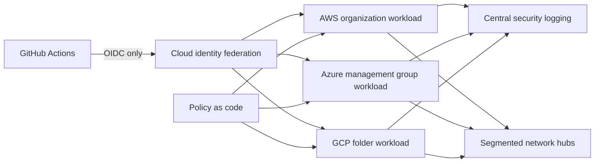

# Secure Multi Cloud Landing Zone

**Status:** In progress. The architecture decision record, threat model, control contract, and a tested AWS trust-policy generator for GitHub Actions OIDC are done. No Terraform exists yet, and Azure and GCP are design-only so far.

## Goal

Build a vendor-neutral reference implementation for secure account and project vending across AWS, Azure, and GCP using Terraform, short-lived workload identity, network segmentation, centralized logging, and policy checks.

## Proof to produce

- Architecture diagram with management, identity, logging, networking, and workload boundaries.
- GitHub Actions OIDC federation with no static cloud credentials.
- Reusable Terraform modules and environment promotion gates.
- Policy tests for public exposure, encryption, logging, and least privilege.
- Automated teardown and a documented cost ceiling.

## Resume signal

Demonstrates that enterprise landing-zone and identity patterns can be communicated publicly without exposing proprietary implementation details.

## Architecture


```mermaid
flowchart LR
  GH[GitHub Actions] -->|OIDC only| ID[Cloud identity federation]
  ID --> AWS[AWS organization workload]
  ID --> AZ[Azure management group workload]
  ID --> GCP[GCP folder workload]
  AWS --> LOG[Central security logging]
  AZ --> LOG
  GCP --> LOG
  AWS --> NET[Segmented network hubs]
  AZ --> NET
  GCP --> NET
  POL[Policy as code] --> AWS
  POL --> AZ
  POL --> GCP
```

The design deliberately separates management, identity, logging, networking, and workload ownership. CI receives short-lived, repository-scoped credentials; no cloud access keys are stored in GitHub.

## Control contract

The machine-readable baseline lives in [`controls/baseline.yaml`](controls/baseline.yaml). Every implementation must demonstrate:

- no anonymous public access;
- encryption at rest and in transit;
- centralized audit logging with defined retention;
- short-lived workload identity;
- environment and owner metadata;
- default-deny boundaries and explicit exceptions;
- automated tests before promotion.

## Delivery sequence

1. Implement provider-specific identity federation modules.
2. Add secure logging/storage foundations for AWS, Azure, and GCP.
3. Generate Terraform plans in CI and evaluate them with policy as code.
4. Publish test output, threat-model coverage, and teardown evidence.

## Current evidence

- [Architecture decision record](docs/ADR-001-identity-and-boundaries.md)
- [Threat model](docs/THREAT-MODEL.md)
- [Baseline control contract](controls/baseline.yaml)
- [OIDC trust configuration](config/oidc-trust.json)
- [AWS trust-policy generator](tools/generate_aws_trust_policy.py)

Run the generator and tests without cloud credentials, from the repository root, with Python 3.9 or newer:

```bash
python3 -m unittest tests.test_oidc_trust_policy -v
python3 projects/01-multicloud-landing-zone/tools/generate_aws_trust_policy.py \
  projects/01-multicloud-landing-zone/config/oidc-trust.json
```

## Sample output

Captured from a clean clone on 5 Oct 2026. `<ACCOUNT_ID>` is a deliberate placeholder, so the output is safe to share.

```json
{
  "Version": "2012-10-17",
  "Statement": [
    {
      "Effect": "Allow",
      "Principal": {
        "Federated": "arn:aws:iam::<ACCOUNT_ID>:oidc-provider/token.actions.githubusercontent.com"
      },
      "Action": "sts:AssumeRoleWithWebIdentity",
      "Condition": {
        "StringEquals": {
          "token.actions.githubusercontent.com:aud": "sts.amazonaws.com",
          "token.actions.githubusercontent.com:sub": "repo:qlester110-sketch/cloud-security-architecture-labs:environment:production"
        }
      }
    }
  ]
}
```

The policy only trusts a token whose subject is this exact repository and the `production` environment, so a fork cannot assume the role. Keeping other branches and pull requests out also depends on the GitHub environment being restricted to protected branches with required reviewers, which is configured in GitHub rather than in this policy.

## Known limitations

- Only the AWS trust policy is generated. Azure federated credentials and GCP workload identity federation are described in the architecture but not implemented.
- The tool prints a policy. It does not create the OIDC provider or the IAM role, and no permissions policy is attached.
- Input values are not validated for format. The use of `StringEquals` means a `*` is matched literally rather than as a wildcard, but the tool does not reject it.
- `role_name` in the config file is not used yet.
- The controls in `controls/baseline.yaml` are a specification. Only IAM-001 and IAM-002 have tests today.
