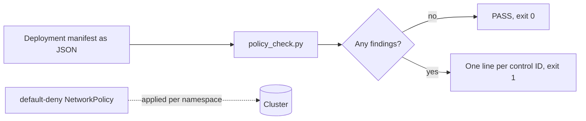

# Kubernetes Security Baseline

**Status:** In progress. An offline workload checker with eight hardening controls, a default-deny NetworkPolicy, secure and insecure fixtures, automated tests, and a browser demo are working. Native admission policy and cluster-based tests are not built yet.

**Try it in the browser:** [live checker](https://qlester110-sketch.github.io/cloud-security-architecture-labs/). The analysis runs entirely client-side.

## Goal

Create a reproducible Kubernetes security baseline covering workload identity, RBAC, network policies, pod-security controls, secrets handling, admission policy, audit logging, and observability.

## How it works



`tools/policy_check.py` reads the pod template from a Deployment and checks each container. The rules are plain Python so they can be read and tested without a cluster. The same rules are mirrored in `docs/app.js` for the browser demo. The plan is to express them as native Kubernetes admission policy next, so the cluster rejects a bad workload at deploy time instead of a script reporting it.

## Controls checked today

| ID | Control |
| --- | --- |
| K8S-001 | Service-account token automount is disabled |
| K8S-002 | Pod requires non-root execution (`runAsNonRoot: true`) |
| K8S-003 | Pod uses the `RuntimeDefault` seccomp profile |
| K8S-004 | Workload defines at least one container |
| K8S-005 | Each container uses an explicit image tag that is not `latest` |
| K8S-006 | Privilege escalation is disabled |
| K8S-007 | Root filesystem is read-only |
| K8S-008 | All Linux capabilities are dropped |
| K8S-009 | CPU and memory requests and limits are declared |

`manifests/default-deny-network-policy.yaml` denies all ingress and egress in the namespace until a more specific policy allows it.

## Run locally

From the repository root, with Python 3.9 or newer and no dependencies:

```bash
python3 -m unittest tests.test_kubernetes_baseline -v
python3 projects/02-kubernetes-security-baseline/tools/policy_check.py \
  projects/02-kubernetes-security-baseline/examples/secure-deployment.json
python3 projects/02-kubernetes-security-baseline/tools/policy_check.py \
  projects/02-kubernetes-security-baseline/examples/insecure-deployment.json
```

## Sample output

Captured from a clean clone on 5 Oct 2026. The secure fixture:

```text
PASS: workload satisfies the Kubernetes security baseline
```

The insecure fixture (exit code 1):

```text
K8S-001 service-account token automount must be disabled
K8S-002 pod must require non-root execution
K8S-003 pod must use RuntimeDefault seccomp
K8S-005 api must use an explicit non-latest image tag
K8S-006 api must disable privilege escalation
K8S-007 api must use a read-only root filesystem
K8S-008 api must drop all Linux capabilities
K8S-009 api must declare resource requests and limits
```

## Known limitations

- It is a static checker, not an admission controller. Nothing stops a non-compliant workload from being deployed.
- Only `containers` are checked. `initContainers` and ephemeral containers are not.
- `privileged: true`, `hostNetwork`, `hostPID`, `hostPath` volumes, and RBAC are not checked yet. The insecure fixture sets `privileged: true`, and it is caught here only because the other controls fail.
- K8S-005 requires a tag, not an immutable digest. A tag such as `1.27.4-alpine` can still be re-pushed. An untagged image from a registry with a port, such as `registry.local:5000/app`, is wrongly accepted because the check looks for any colon.
- Input must be JSON. YAML manifests need converting first.
- The default-deny NetworkPolicy is checked as text in a test, not applied to a running cluster.

## Planned next

- Native `ValidatingAdmissionPolicy` resources carrying the same rules, tested against a local kind cluster.
- Checks for privileged mode, host namespaces, `hostPath`, and init containers.
- Digest-pinned images and signature verification at admission.
- RBAC review, controlled egress, and a controlled failure exercise.

## Resume signal

Closes the most common gap across platform-security, infrastructure-security, and SRE roles.
