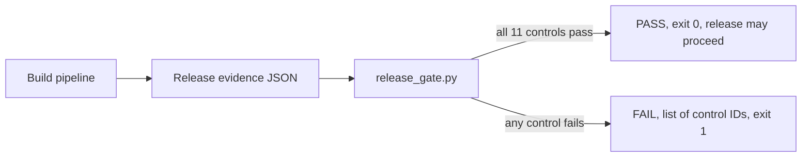

# Software Supply Chain Security

**Status:** In progress. A release gate that evaluates a release-evidence document against eleven controls is working, with secure and insecure fixtures and six tests. It does not yet generate an SBOM, sign anything, or verify a real signature.

## Goal

Build a secure CI/CD reference pipeline that generates an SBOM, runs SAST and dependency analysis, signs artifacts, emits provenance, and enforces admission policy before deployment.

## Proof to produce

- GitHub Actions workflow with least-privilege permissions and OIDC.
- SAST, SCA, secret scanning, and infrastructure scanning.
- CycloneDX or SPDX SBOM generation.
- Cosign signing and provenance verification.
- A deliberately vulnerable change that the pipeline blocks.

## Resume signal

Adds concrete product-security and DevSecOps evidence for Chainguard, GitLab, GoodLeap, and 1Password-style roles.

## Release contract

A release passes only when it has:

- an immutable SHA-256 artifact digest;
- an SPDX 2.3 SBOM with versioned packages and checksums;
- source and builder provenance tied to a full commit SHA;
- an OIDC-backed build identity;
- a verified artifact signature;
- no critical or high-severity unresolved vulnerabilities.

## How it works



The gate is the decision point at the end of a pipeline. It reads one JSON document describing the artifact digest, signature result, SBOM, provenance, and vulnerability counts, and blocks the release if any control fails.

Run the gate from the repository root, with Python 3.9 or newer and no dependencies:

```bash
python3 -m unittest tests.test_supply_chain -v
python3 projects/03-software-supply-chain/tools/release_gate.py \
  projects/03-software-supply-chain/examples/secure-release.json
python3 projects/03-software-supply-chain/tools/release_gate.py \
  projects/03-software-supply-chain/examples/insecure-release.json
```

## Sample output

Captured from a clean clone on 5 Oct 2026. The insecure fixture fails ten of the eleven controls (exit code 1). SC-004 does not fire because the fixture does list a package, which then fails SC-005 and SC-006.

```text
FAIL
SC-001 artifact requires an immutable SHA-256 digest
SC-002 artifact signature must be verified
SC-003 release requires an SPDX 2.3 SBOM
SC-005 every package requires name and version
SC-006 every package requires a SHA-256 checksum
SC-007 provenance requires a full source commit SHA
SC-008 provenance requires an approved source URI
SC-009 build identity must use OIDC
SC-010 critical vulnerabilities block release
SC-011 high vulnerabilities block release
```

The secure fixture prints `PASS: release evidence satisfies the supply-chain policy` with exit code 0. Its digests and commit SHA are placeholder values, not a real artifact.

## Known limitations

- The gate trusts the evidence document. `signature.verified: true` is accepted as stated. Nothing calls Cosign or checks a real SBOM file.
- Vulnerability evidence is required. Missing, negative, boolean, or non-integer critical and high counts fail closed under SC-010 and SC-011.
- SC-008 currently permits only this portfolio repository. A production implementation should load its approved source repositories from reviewed policy configuration.
- SC-003 checks a format label, not the SBOM content.
