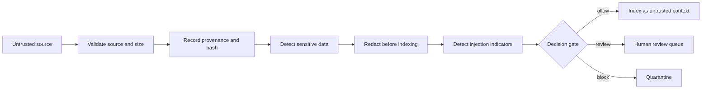

# AI Ingestion and Agentic Security Lab

**Status:** In progress — deterministic ingestion guardrail and evaluation suite complete.

## Goal

Evaluate an isolated tool-using agent against prompt injection, indirect injection, excessive agency, data exfiltration, unsafe tool invocation, and authorization-boundary failures.

The first deliverable secures the point where documents and messages enter an AI workflow. It treats retrieved content as untrusted data, records its provenance, detects injection indicators, redacts common sensitive values, and routes uncertain content to review.

## Proof to produce

- Synthetic attack corpus mapped to OWASP guidance.
- Explicit tool permissions and human-approval boundaries.
- Automated eval harness with pass/fail criteria.
- Baseline and hardened results with measurable changes.
- Findings report containing severity, reproduction steps, and mitigations.

## Resume signal

Converts AI-security study and guarded AI engineering into public, testable security evidence.

## Why ingestion is a security boundary

An AI workflow can retrieve a legitimate-looking webpage, document, email, or ticket containing instructions intended for the model rather than the human reader. Content does not become trusted merely because retrieval succeeded. The ingestion layer must preserve the source, transform content predictably, and prevent retrieved text from granting itself authority.

## Processing flow



## Best-practice principles demonstrated

1. **Separate instructions from data.** Retrieved content never changes system policy or tool permissions.
2. **Minimize before indexing.** Retain only the fields and text required for the intended task.
3. **Preserve provenance.** Record source type, source identifier, ingestion time, and a content hash.
4. **Classify and redact.** Detect common personal data and secrets before content reaches an index or model.
5. **Assume indirect prompt injection.** Suspicious instruction-like content is quarantined or reviewed.
6. **Use explicit allowlists.** Accepted source types, file sizes, tools, and destinations are declared in code.
7. **Keep authorization outside the model.** The model can propose an action but cannot grant itself access.
8. **Require approval for consequential actions.** Publishing, deletion, purchases, credential changes, and external messages need a deterministic gate.
9. **Evaluate continuously.** Safe and adversarial fixtures run on every repository change.
10. **Make retention deliberate.** Raw content, transformed content, indexes, and logs have separate retention rules.

## Run the demonstration

```bash
python projects/04-agentic-ai-security/tools/safe_ingest.py \
  projects/04-agentic-ai-security/examples/safe-record.json
python -m unittest tests.test_ai_ingestion -v
```

This is a learning implementation, not a replacement for enterprise DLP, malware scanning, or a production content-disarm pipeline.
